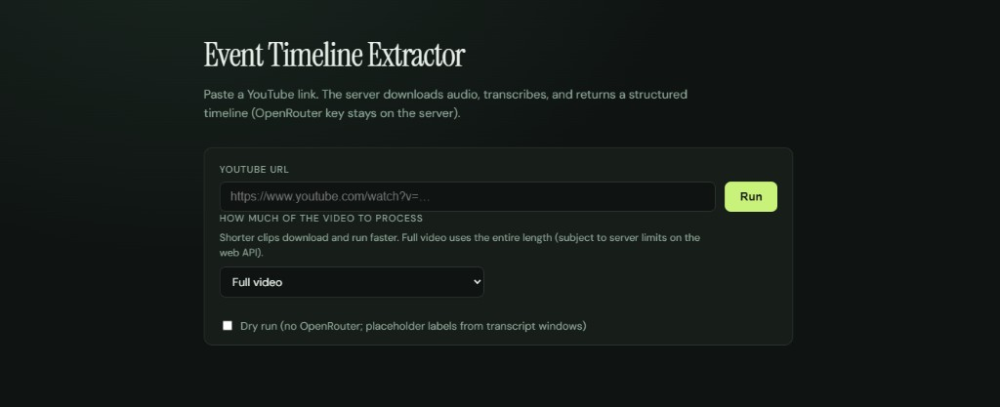

# Event Timeline Extractor

<p align="center">
  
</p>

**Turn recordings into searchable event timelines** for **QA**, **coaching**, and **risk review**—think **body-worn camera** footage, **contact center** calls, and similar workflows where you need a **structured, time-anchored narrative** from long audio or video, not only a raw transcript.

This repo is a **small, hackable pipeline**: **YouTube** or **local files** → **[faster-whisper](https://github.com/SYSTRAN/faster-whisper)** (ASR) → windowed chunks → **[OpenRouter](https://openrouter.ai/)** (LLM) → **JSON timeline**. It ships a **`ete` CLI** and a **local web UI** (FastAPI). More features and integrations are planned; treat this as a **component** you can embed or extend, not a finished platform.

**Status:** incomplete as of **2026-03-22** — roadmap includes richer examples (e.g. side-by-side clip + output), exports, and workflow hooks.

## Highlights

- **CLI**: `ete run --url …` or `--file …` — writes timeline JSON to stdout or `--out`.
- **Web**: single-page UI on localhost for quick runs; same pipeline as the CLI.
- **Stack**: Whisper-class ASR + LLM summarization into labeled events with timestamps (see **Timeline accuracy** below).
- **Transcription**: **faster-whisper** by default (real audio). Set `ETE_TRANSCRIBER=stub` or `ETE_USE_STUB=1` only for tests — that path uses fixed fake lines, not your video.
- **Speed**: Text-only to the LLM (no frame extraction by default). ASR uses `beam_size=1`, optional VAD, and caches the Whisper model in memory for the web server process.
- **Safety / dev**: `--dry-run` skips the LLM; `--max-minutes` caps input length.

## Requirements

- Python 3.10+
- **ffmpeg** and **ffprobe** on `PATH` (audio extraction only).
- **yt-dlp**: included as a **Python dependency** (`pyproject.toml`). After `pip install -e .`, the downloader uses the `yt-dlp` console script next to your Python, or falls back to `python -m yt_dlp`.
- **OpenRouter** API key in the environment for real runs (unless `--dry-run`).

## Install (dev)

```bash
python -m venv .venv
.venv\Scripts\activate   # Windows
pip install -e ".[dev]"
```

If Windows reports **Access is denied** when writing to a system Python folder, use `pip install -e ".[dev]" --user` instead (same packages, installs into your user site).

Copy `.env.example` to `.env` and set `OPENROUTER_API_KEY` (never commit `.env`). From the project root, `python-dotenv` loads `.env` automatically when you run `ete` or `uvicorn`.

## CLI

```bash
# Dry run: no OpenRouter; placeholder events from transcript windows
ete run --file clip.mp4 --dry-run --work-dir .ete_work

# YouTube — first 20s only (smaller download, faster test)
ete run --url "https://www.youtube.com/watch?v=…" --max-seconds 20 -o timeline.json

# Full video
ete run --url "https://www.youtube.com/watch?v=…" -o timeline.json
```

Stub transcriber + dry run is the fastest way to verify the pipeline without API spend:

**cmd.exe**

```bat
set ETE_USE_STUB=1
set ETE_TRANSCRIBER=stub
ete run --file clip.mp4 --dry-run
```

**PowerShell**

```powershell
$env:ETE_USE_STUB = "1"
$env:ETE_TRANSCRIBER = "stub"
ete run --file clip.mp4 --dry-run
```

## Web UI

Bind to localhost only by default.

**Stable server (recommended for real runs)** — avoids `net::ERR_CONNECTION_RESET` / “Failed to fetch” during long jobs:

```bash
python -m uvicorn event_timeline_extractor.web.app:app --host 127.0.0.1 --port 8766
```

Do **not** use `--reload` while processing full videos: the file watcher can **restart the process** mid-request and the browser sees a **connection reset**. Use `--reload` only when editing code, or exclude noisy paths, e.g.:

```bash
python -m uvicorn event_timeline_extractor.web.app:app --host 127.0.0.1 --port 8766 --reload --reload-exclude "*__pycache__*" --reload-exclude "*.pyc"
```

On Windows: `scripts\\run-web.ps1` starts the stable server; `scripts\\stop-web.ps1` frees ports **8765–8768** if old uvicorn processes are stuck.

Open `http://127.0.0.1:8766/` (or your chosen port). Paste an **https** YouTube link. Choose **how much of the video** to process (full length, presets, or custom seconds). Use **Dry run** to skip OpenRouter.

`GET /api/health` returns `{"ok":true}` if the server is responding.

### Troubleshooting: DevTools noise vs real problems

| Message | Meaning |
|--------|---------|
| `chrome-extension://invalid/` **net::ERR_FAILED** | A **Chrome extension** (ad blocker, wallet, etc.). **Ignore** — not this app. |
| `favicon.ico` 404 | Fixed in current code (`204` response). Hard-refresh if you still see 404. |
| `ERR_CONNECTION_REFUSED` on `:8766` | **Nothing is listening** on that port — the **server is not running** (or it exited). Start it again and keep the terminal/window open. |
| `ERR_CONNECTION_RESET` | Connection dropped mid-request — often **`--reload`** restarting the process; use a server **without** `--reload` (see above). |

**Easiest way to run the server (Windows):** double‑click **`run-web.bat`** in the project folder. Leave that **black window open** while you use Chrome. If you close it, `ERR_CONNECTION_REFUSED` will happen.

If you still see **“Failed to fetch”** after fixing **connection refused** / **reset** (above): restart uvicorn **without** `--reload`, confirm **`/api/health`**, use **Chrome or Edge** (not a preview panel), and try a **short clip** or **Dry run** first.

The page title uses **Instrument Serif** (Google Fonts); body text uses **DM Sans**.

Do not expose this port to the internet without authentication.

## Future: vision / multimodal (not implemented)

This project feeds the LLM **transcript text only** to keep latency and **token cost** down. Image or video frames are **not** sent to the model.

If you later add a vision-capable model (e.g. via OpenRouter), you can **sample frames with ffmpeg** from a local file and pass those images into the API alongside text—for example:

```bash
# One JPEG every 2 seconds (adjust fps=1/2 to change interval)
ffmpeg -y -i input.mp4 -vf "fps=1/2" -q:v 3 frames/frame_%06d.jpg
```

Typical workflow: align frames to the same time windows as the transcript, cap how many images you send per request, and pick a multimodal model—then budget for **much higher** token usage than text-only runs. This repo intentionally does **not** wire that up by default.

## Security (operational)

- For the web UI, the **API key stays server-side** (the page does not embed secrets). Logs redact keys where applicable (`llm/openrouter.py`).

## Tests

```bash
pytest
```

Integration tests that shell out to **ffmpeg** are skipped automatically if `ffmpeg` is missing. They expect ffmpeg behavior consistent with a short synthetic MP4 (silent audio + black video).

## Cost

OpenRouter charges per model/token. Long videos and small `--window-sec` values increase LLM cost. Use `--dry-run` and stubs while developing.

## Transcription and speed

Default install includes **faster-whisper**. First run downloads the **small** model (~500MB) into the cache; GPU is used automatically when `torch` sees CUDA.

To go faster on long files, set in `.env` e.g. `ETE_WHISPER_MODEL_SIZE=base` or `tiny` (less accurate). For fewer gross word errors (at CPU/GPU cost), try **`medium`** or **`large-v3`**. Set **`ETE_WHISPER_WORD_TIMESTAMPS=true`** if you want per-word timing from Whisper (slightly more compute; pairs with stricter timeline anchoring).

### ASR limits (names and proper nouns)

Whisper-style models often mis-hear **proper nouns** and rare words (phonetic substitutions). The timeline pipeline asks the LLM to quote **verbatim** transcript text in `evidence` and **not** “fix” spellings—so a name error in the transcript will appear in summaries unless you add a **manual review** step or a **custom dictionary / entity list** downstream. There is no guaranteed celebrity-name accuracy from ASR alone.

If you still see **“Unit one: approach the vehicle”** in output, that’s the **stub** transcriber (see `transcription/stub.py`). Ensure **`ETE_TRANSCRIBER=faster_whisper`** and **`ETE_USE_STUB=0`** in `.env`, then **restart** `uvicorn` / the terminal.

**Note:** On Windows, a leftover **`ETE_USE_STUB=1` in the shell environment** can override `.env` (pydantic-settings gives OS env priority). Either `set ETE_USE_STUB=0` before starting the server, or close that terminal. The app now prefers **faster-whisper whenever `ETE_TRANSCRIBER=faster_whisper`** so `.env` wins for that flag.

## Timeline accuracy (prompts, validation, diarization)

- **Segment-structured windows**: Chunk text sent to the LLM is **one line per ASR segment** with **`[MM:SS]`** timestamps (and **`speaker:`** when known). Prompts require **`time`** to match a segment line’s timestamp, **`evidence`** to be a verbatim substring, and **`speaker`** to stay neutral or null (no guessing “officer” vs “driver” without real turn labels).
- **Temperature**: Default **`ETE_OPENROUTER_TEMPERATURE=0.05`** reduces creative paraphrasing.
- **Evidence validation**: With **`ETE_VALIDATE_EVIDENCE=true`**, events whose `evidence` is not found in the full transcript (after whitespace normalization) are **dropped**; `meta.validation.dropped_events` and `meta.warnings` record what happened.
- **Optional diarization**: Set **`ETE_DIARIZATION=pyannote`**, install **`pip install -e ".[diarize]"`**, set **`HF_TOKEN`**, and accept the **pyannote** model conditions on Hugging Face. That assigns **speaker labels** to each segment; chunk lines become `[MM:SS] SPEAKER_xx: text`. If pyannote is not installed or diarization is **`none`**, speakers stay unset unless your transcriber fills them.

Response **`meta`** may include **`asr_model`**, **`diarization`**, **`word_timestamps`**, **`llm_temperature`**, **`validation`**, and **`warnings`**.

## Publishing to GitHub

1. Create an **empty** repository on GitHub (no README/license if you already have them here).
2. From the project root:

```bash
git status   # confirm .env, .venv, and media/work dirs are not listed
git add .
git commit -m "Initial commit: Event Timeline Extractor"
git branch -M main
git remote add origin https://github.com/YOUR_USER/YOUR_REPO.git
git push -u origin main
```

Optional: set the GitHub repo **Description** and **Website** (e.g. link to your docs or demo). The README image above is what visitors see on the repo main page.

## License

MIT
